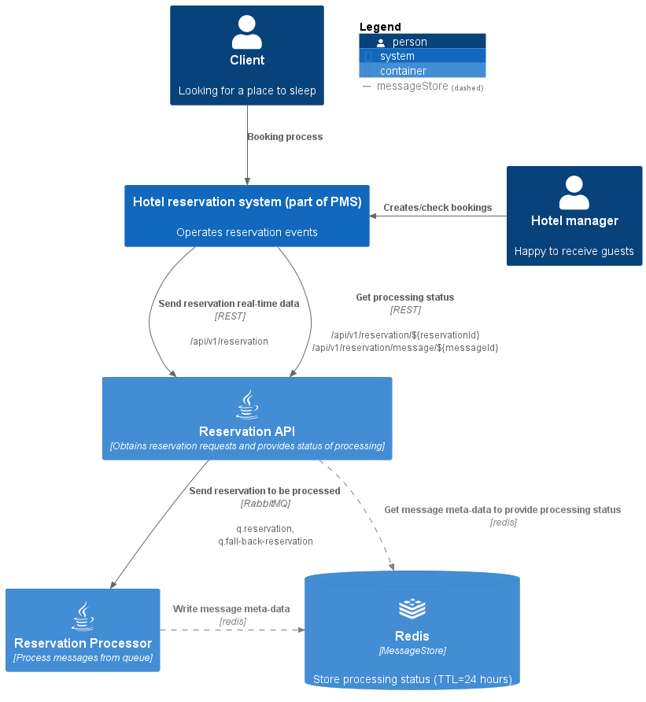

# RateBoard practical task - Reservation API and messaging queues

## Overview

Original task `
Create two services.  
One service contains a REST API that can receive these
messages/strings. The second service is a processor that will process the incoming
messages. Both services are connected by a message queue. In your case the
processor doesn’t need to do anything useful, just log that it was processed. Assume
that multiple API services can run in parallel on different hosts, and there is only one
processor instance. Please also consider the case that the processor could be
unreachable for some time but you shouldn’t lose messages.`
### Scheme


## My assumptions:

- Request from PMS is a valid **JSON** string, containing *reservationId, creationTimestamp and payload.*

- Not a huge amount of data expected, e.g. **1000/RPS in peaks**.

- Reservation System wants to know the **status of processing** and should be able to get processing details by request.
  As well it should be able to request "all processing history" by some reservationId.

- If message wasn't processed correctly (e.g. because of invalid message structure) such message should be rejected to *
  *fall-back queue** to be processed in another way (e.g. reservation status should be marked as "unknown").

-----

## Technologies

- **Spring Boot 3**: Leveraging the latest Spring Boot framework ensures high performance and maintainability.

- **Spring Data JPA**: Spring Data simplifies data access, making it easier to work with Redis database.

- **RabbitMQ**: Reliable and high-performance solution for fast messaging between services. Provide build-in strict
  ordering support. (Below you can find a comparison with Kafka and ActiveMQ).

- **Redis**: Fast key-value storage is used to store requests meta-data and processing history for last 24 hours, as
  well it helps to implement [MessageStore design pattern](https://www.enterpriseintegrationpatterns.com/patterns/messaging/MessageStore.html).

- **Lombok**: Lombok reduces boilerplate code, improving code readability and maintainability.

- **Mockito, JUnit 5, WireMock and Testcontainers**: Rigorous testing methodologies guarantee the reliability of the
  service.

- **API Documentation**: Swagger(openAPI) has been integrated for clear and comprehensive API documentation, making it easy for
  users and developers to understand and interact with the service.

- **Nginx**: Simple nginx configuration allow us to scale Reservation API service via docker-compose to provide
  necessary level of performance.

## Getting Started

### This service requires only git and docker installed locally. All build steps will be performed inside docker containers.

#### Follow these steps to set up and run the Reservation Processor Service on your local machine using Docker:

1. Clone this repository to your local system using `git clone`.

2. Navigate to the project directory.

3. Run the application using docker-compose:

- Build and run in background. Don't forget to change default API_KEY via env passing.
   ```shell
   docker-compose up -d
   ```
- Check logs
   ```shell
   docker-compose logs -f
   ```

4. Access the API documentation at http://localhost:8080/swagger-ui/index.html to explore the available endpoints and
   requests examples and interact with the service.


**Some example requests:**
- Create new reservation
    ```shell
    curl --request POST --location 'http://localhost:8080/api/v1/reservation' \
      --header 'Content-Type: application/json' \
      --header 'Authorization: swordfish' \
      --data '{
        "reservationId": "12345",
        "payload": {
            "reservationDate": "2024-04-01T10:00:00Z",
            "numberOfAdults": 2,
            "numberOfChildren": 0,
            "roomType": "double"
       },
       "updatedAt": "2024-02-01T10:00:00Z"
   }'
  ```
- Get all messages with processing time by reservationId
  ```shell
    curl --location 'http://localhost:8080/api/v1/reservation/12345' --header 'Authorization: swordfish'
  ```


5. To stop the application please use the command:
   ```shell
   docker-compose down
   ```

## Q&A

### Why don't Kafka or ActiveMQ(JMS) for messaging?

#### Here are some key features of RabbitMQ:

* **Message Ordering**: RabbitMQ ensures message ordering within a single queue, guaranteeing that messages
are processed in the order they were received. This adherence to the FIFO principle ensures consistency and reliability,
especially crucial when dealing with one consumer and multiple producers.

* **Ease of Use**: RabbitMQ is known for its simplicity and ease of setup. It provides a user-friendly management interface and
  supports a bunch of client libraries.

* **Fault Tolerance**: RabbitMQ offers fault tolerance through features such as high availability configurations and
  clustering. This ensures resilience to node failures and data integrity, making it suitable for mission-critical
  applications.

* **Dead-Letter Exchanges**: RabbitMQ includes a dead-letter exchange mechanism for handling undeliverable messages.
  Messages that cannot be routed or processed can be automatically redirected to a dead-letter queue, simplifying error
  handling and troubleshooting.

#### Comparison with Kafka and JMS:

| Feature               | RabbitMQ                              | Kafka                                 | ActiveMQ (JMS)                                 |
|-----------------------|---------------------------------------|---------------------------------------|------------------------------------------------|
| Protocol              | AMQP, MQTT, and more                  | Proprietary (Kafka Protocol)          | JMS (Java Message Service)                     |
| Message Ordering      | Guaranteed within a single queue      | Guaranteed within a partition         | Guaranteed within a queue                      |
| Ease of Use           | User-friendly setup and configuration | Complex setup for high scalability    | Java-centric, easy integration                 |
| Fault Tolerance       | Replication, clustering               | Replication, distributed commit logs  | Only data replication(RAID, Clustered DB, etc) |
| Dead-Letter Exchanges | Supported                             | Not native, requires additional setup | Supported                                      |

In this comparison, **RabbitMQ** can be picked up as a strong choice for applications requiring strict message ordering,
particularly when simplicity, fault tolerance and performance are essential.  

**Kafka** probably offers better scalability and performance for high-throughput environments, especially 
streaming big amount of data, but it requires **complex set up**, which seems to be not required for communication between only 2 services.  

**ActiveMQ (JMS)** provides seamless integration with Java applications and compliance with JMS standards, it can be also a possible choice for the project, 
but in my opinion ActiveMQ more suitable for medium-sized Enterprise applications.

The choice ultimately depends on specific requirements and priorities, such as required performance, message ordering guarantees, scalability needs, and ecosystem compatibility.
#### Useful articles:
https://quix.io/blog/apache-kafka-vs-rabbitmq-comparison#kafka-vs-rabbitmq-features  
https://www.projectpro.io/compare/rabbitmq-vs-apache-activemq  
https://stackoverflow.com/questions/21363302/rabbitmq-message-order-of-delivery   

----
### Do you see any problems with this setup?
1. **Throughput is limited** as rabbitMQ and redis have pretty standard set-up "from the box" and Spring app wasn't configured for a real "high-load" (threads limit not configured).  
My assumption was that not high amount of data is expected, but if data stream will be too big and too fast 
(e.g. all reservations from booking.com) for sure deploy(cpu/ram limit) and rabbitMQ/redis configs will require some changes. RabbitMQ standard queue in case of performance issue can be replaced by Rabbit Streams or by Kafka.
2. **It's not production-ready**. RabbitMQ and Redis lives inside docker, although data folders stores on host machine and won't be lost, 
in production they should live in cluster on different nodes to have higher fault tolerance level. Spring Cloud Sleuth will be helpful for tracing the requests.  
Authorisation mechanism (API_KEY) should be replaced by normal security scheme(e.g. auth-service by JWT tokens).

----
### What kind of data does the sender’s message HAVE TO contain to ensure they are imported in the correct order?

Sender should provide timestamp of message creation in source system.   
Timestamps will allow `reservation-processor` to "re-apply" previous messages e.g. in Database (state should be saved).

----
### Are there any optimisations you see but didn’t implement?

- Async calls to RabbitMQ and MessageStore to reduce response time to PMS.
- "Race condition" between `api` and `processor` while new entry in MessageStore creates (rabbit sometimes faster than redis). Not a big issue as data saved correctly anyway, can be fixed via distributed lock or via routing copy of messages to 3rd service.

----
## Load Testing
Application has been tested with Apache JMeter. Configuration file you can find under ```./JMeter``` folder.  

Test performed locally on Windows 10 PC with Intel i5-8250U CPU(1.80 GHz), 8GB RAM, probably this set up is not fine enough for 5 working containers in docker :)


Results for 500 simultaneous requests are following:  
**POST reservation**: throughput **280RPS**, avg. response time **900ms**, error rate **0%**  
**GET processing status**: throughput **292RPS**, avg. response time **24ms**, error rate **0%**.  
All messages were successfully processed by "reservation processor", avg. processing time: **10ms**.


#### Conclusions after load testing:
There is quite high value of avg. response time for initial POST requests (0.9s).  
**Solution** If such time is not appropriate for the source system, it is possible to return messageId to the sender immediately after generation and call "sendToQueue" and "saveToMessageStore" methods asynchronously.

-----
#### Links:
https://www.altexsoft.com/blog/hotel-property-management-systems-products-and-features/  
https://www.enterpriseintegrationpatterns.com/patterns/messaging/MessageStore.html  


